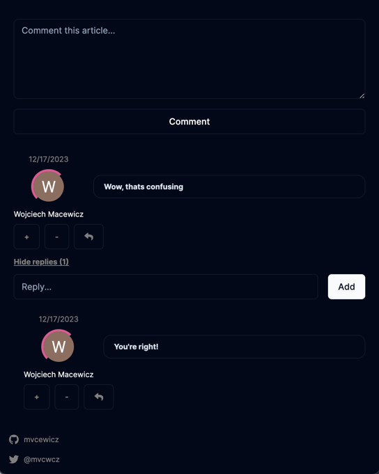

## WebBlog.AI

Demo: [https://web-blog-ai.vercel.app/](https://web-blog-ai.vercel.app/)

### Preview

---

### 1. Introduction

This is web application which generates blogs using AI.

Blogs are posted every day and are generated using OpenAI's GPT-3 model.

Users are able to vote and comment on blogs.

### 2. Tech Stack

| Name                                                              | Description          |
|-------------------------------------------------------------------|----------------------|
| [TypeScript](https://www.typescriptlang.org/)                     | Programming Language |
| [React](https://react.dev/)                                       | Frontend Framework   |
| [Next.js](https://nextjs.org/)                                    | React Framework      |
| [AWS Lambda](https://aws.amazon.com/lambda/)                      | Serverless Function  |
| [AWS CloudWatch Events](https://docs.aws.amazon.com/eventbridge/) | Cron Job             |
| [TanStack (react-query)](https://www.tanstack.com/)               | React Framework      |
| [Tailwind CSS](https://tailwindcss.com/)                          | CSS Framework        |
| [shadcn-ui](https://ui.shadcn.com/)                               | UI Library           |
| [Vercel](https://vercel.com/)                                     | Hosting Platform     |
| [OpenAI](https://openai.com/)                                     | AI Model             |
| [Prisma](https://www.prisma.io/)                                  | ORM                  |
| [Turborepo](https://turbo.build/)                                 | Monorepo Tool        |
